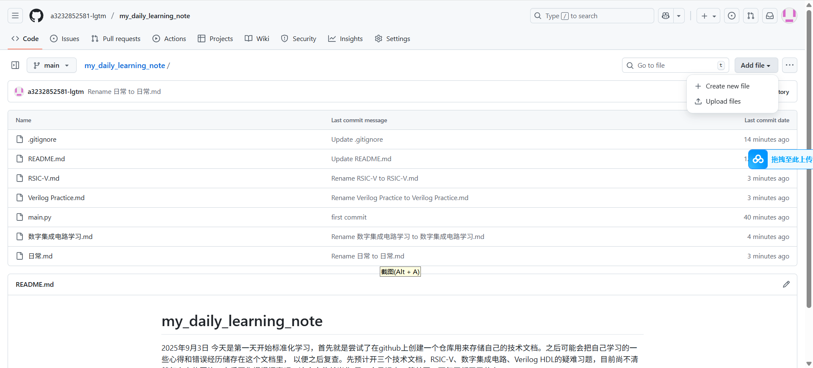

参考资料1 https://gitee.com/chuan-yi-wang/tinyriscv  
参考资料1.1 从零开始写RISC-V处理器 https://cloud.tencent.cn/developer/article/1813595?from=15425
参考资料2 https://space.bilibili.com/3280670?spm_id_from=333.788.upinfo.head.click  
参考资料3 《手把手教你设计CPU  RISC-V处理器篇》（先放着，不确定之后看不看）
参考资料4 《手把手教你设计RISC-V 处理器》 哔哩哔哩https://www.bilibili.com/video/BV1ZA4y197ng/?spm_id_from=333.337.search-card.all.click&vd_source=33e023647aa5a3b2b8e3d890546be051

2025/9/3 第一天学习
核心概念：RISC-V 是什么？
RISC-V 是一个基于精简指令集（RISC） 原则的开源、免费的指令集架构（ISA），和ARM、MIPS这些是属于同一类东西

三级流水线 取指、译码和执行
取指 从程序存储器（通常是内存或指令缓存）中读取下一条要执行的指令，PC值自动增加，指向下一条指令的地址（例如，每条指令占4字节，则 PC = PC + 4）。  
译码 译码器解析指令中的操作码、寄存器地址  
执行 完成指令所要求的实际计算或操作 
并行： 
时钟周期 3:  
取指单元：取 指令3  
译码单元：解码 指令2  
执行单元：执行 指令1  

TCK	全称Test Clock  	      
|方向 输入	|为JTAG调试逻辑提供同步时钟	时钟信号，频率独立于系统主时钟  
TMS	全称Test Mode Select  
|方向 输入	|控制JTAG状态机的转换路径	在TCK上升沿被采样  
TDI	全称Test Data In  	    
|方向 输入	|将调试指令或数据串行移入CPU内部的JTAG调试模块	在TCK上升沿被采样  
TDO	全称Test Data Out  	    
|方向 输出	|将CPU内部的调试数据（如寄存器值、内存内容）串行移出至调试器	在TCK下降沿变化  

jtag_top：调试模块的顶层模块，主要有三大类型的信号，第一种是读写内存的信号，第二种是读写寄存器的信号，第三种是控制信号，比如复位MCU，暂停MCU等  
pc_reg：PC寄存器模块，用于产生PC寄存器的值，该值会被用作指令存储器的地址信号。  
if_id：取指到译码之间的模块，用于将指令存储器输出的指令打一拍后送到译码模块。  
id：译码模块，纯组合逻辑电路，根据if_id模块送进来的指令进行译码。当译码出具体的指令(比如add指令)后，产生是否写寄存器信号，读寄存器信号等。由于寄存器采用的是异步读方式，因此只要送出读寄存器信号后，会马上得到对应的寄存器数据，这个数据会和写寄存器信号一起送到id_ex模块。  
id_ex：译码到执行之间的模块，用于将是否写寄存器的信号和寄存器数据打一拍后送到执行模块。解决时序问题。这样，每个阶段都只在“自己的”时钟周期内工作，并通过寄存器将成果传递给下一个阶段。所有阶段并行工作，但又互不干扰。（交换区）        
“打一拍”的意思就是：用一个时钟触发器（Register）将输入信号保存一个时钟周期，然后在下一个时钟周期输出。  
ex：执行模块，纯组合逻辑电路，根据具体的指令进行相应的操作，比如add指令就执行加法操作等。此外，如果是lw等访存指令的话，则会进行读内存操作，读内存也是采用异步读方式。最后将是否需要写寄存器、写寄存器地址，写寄存器数据信号送给regs模块，将是否需要写内存、写内存地址、写内存数据信号送给rib总线，由总线来分配访问的模块。  
div：除法模块，采用试商法实现，因此至少需要32个时钟才能完成一次除法操作。  
ctrl：控制模块，产生暂停流水线、跳转等控制信号。  
clint：核心本地中断模块，对输入的中断请求信号进行总裁，产生最终的中断信号。  
rom：程序存储器模块，用于存储程序(bin)文件。  
ram：数据存储器模块，用于存储程序中的数据。  
timer：定时器模块，用于计时和产生定时中断信号。目前支持RTOS时需要用到该定时器。  
uart_tx：串口发送模块，主要用于调试打印。  
gpio：简单的IO口模块，主要用于点灯调试。  
spi：目前只有master角色，用于访问spi从机，比如spi norflash。  

RSIC-V 干净、开源  设计CPU SOC 开发能力

**步骤1：环境搭建**
LINUX 和 windows 我都准备跑一遍
先跑VMWare  由于之前的centos7是直接移植的，这次准备跟着视频重新从零开始装个新的，安装包下载3小时，明天再继续搭环境。

20520911
预计使用centOS7环境，目前环境已经安装的差不多了

risc-v运行及测试 参考https://www.bilibili.com/video/BV1TF411B7Kh?spm_id_from=333.788.videopod.sections&vd_source=33e023647aa5a3b2b8e3d890546be051

**以下都是linux环境**
打开tinyrisc-v sim目录（simulation）打开终端，执行
python .\sim_new_nowave.py ..\tests\isa\generated\rv32ui-p-add.bin inst.data  
会报错  
linux环境下划线是向左的python ./sim_new_nowave.py ../tests/isa/generated/rv32ui-p-add.bin inst.data
出错 ，报错
  File "./sim_new_nowave.py", line 8
SyntaxError: Non-ASCII character '\xe4' in file ./sim_new_nowave.py on line 8, but no encoding declared; see http://www.python.org/peps/pep-0263.html for details  
python已经运行，但是有语法错误---由于现在的python软链还是2.7.5  
删除原本软链接 rm /usr/bin/python（root权限）
添加新软链ln -s /usr/local/python3/bin/python3.7 /usr/bin/python

发现还是有很多iverilog的文件存储位置不对，按ln -s /home/rocky/iverilog/tgt-vvp/vvp.tgt /home/rocky/iverilog/lib/ivl/vvp.tgt的方法改了一下文件位置，不知道还有没有别的错的

