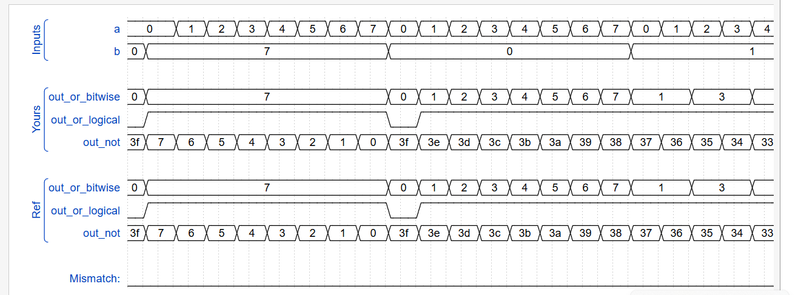
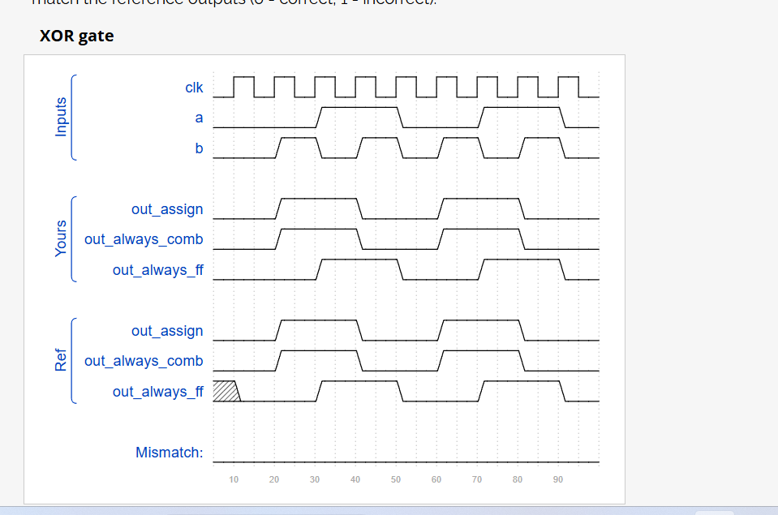
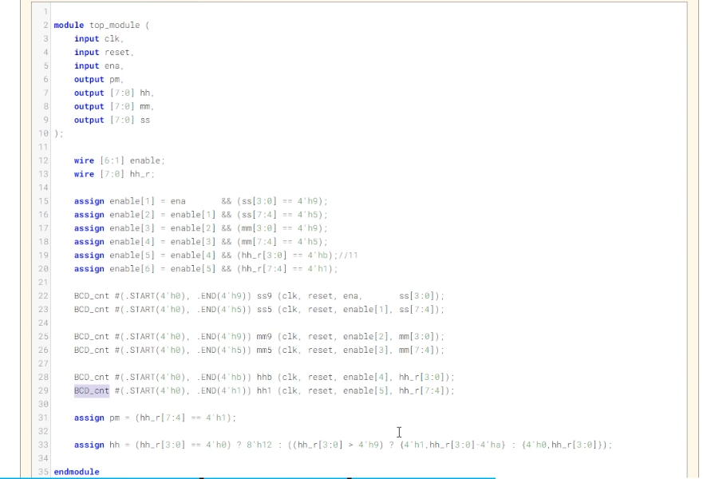

参考网址   https://hdlbits.01xz.net/wiki/Main_Page

主要用于之后做一些verilog练习后把错误点记录在此处

2025/9/3  
开始今日练习
Q1 We want to assign 1 to the output one.  
`module top_module( output one );`  
`	assign one = 1'b1;`  
`endmodule`  

注意：1'b1代表了2进制形式的1，最好不要省略'b1

assign 用于声明一个“连续赋值”  
它表示等号（=）右侧表达式的结果会持续地、主动地驱动左侧的线网（wire）。只要右侧表达式的值发生变化，左侧的值就会立即更新。
你可以把它想象成用一根导线直接将右侧的信号源连接到左侧的信号线上。
在 assign 语句中，这个等号表示“驱动”或“连接”，而不是软件编程中的“赋值”操作
我们来解析 1'b0：

1： 表示这个数字的位宽（Bit-width） 是 1 位。也就是说，这个常量只有 1 个二进制位。

b： 表示进制（Base），这里是二进制（Binary）。其他常见的进制有：

d 或省略：十进制（Decimal）

h：十六进制（Hexadecimal）

o：八进制（Octal）

0： 表示在这个指定位宽和进制下的数值。这里就是在二进制下的 0。

所以，1'b0 的含义就是：一个 1 位宽的二进制数，其值为 0。

**Wire**  
Verilog里的线是定向的，将右边的值驱动到左边
是连续的，不是一次性的  

**Four Wire**   
注意，当你使用=代表wire时，最前面要有assign不然会报错  

**Notgate**  
非操作 可以使用 按位取反~  和 逻辑取反!  
用“ - ”不行  
逻辑取反是 将真值翻转：非零 变 0，零 变 1，返回一个单比特的布尔值：1‘b0 或 1’b1  

**Andgate**  
与   bitwise-AND (&) and logical-AND (&&)    

**Norgate** 
bitwise-OR (|) and logical-OR (||) operators
做或非的时候要注意加括号      assign out = ~(a|b);    
**XNorgate**   
The bitwise-XOR operator is ^. There is no logical-XOR operator.  
    assign out = a^~b  

**Declaring wires**   
声明一个wire 用于连接

再写一个多个门的时候，您可以选择使用一个赋值语句来驱动每条输出线，或者您可以选择声明（多）条线作为中间信号，其中每条内部线由一个与门的输出驱动。  

**Vector** 
向量 例：wire [99:0] my_vector; 

wire [2:0] a, c;   // Two vectors
assign a = 3'b101;  // a = 101
assign b = a;       // b =   1  implicitly-created wire
assign c = b;       // c = 001  <-- bug
my_module i1 (d,e); // d and e are implicitly one-bit wide if not declared.
                    // This could be a bug if the port was intended to be a vector.

b被隐性赋值，导致 b只是1位的1，c只有c[0]被赋值了

`default_nettype none
添加这行后，任何未声明的标识符都会导致编译错误，从而迫使你立刻发现并修复问题。

reg [7:0] mem [255:0]; 使用这样的方法后，若要调用其中一个值，要经过以下步骤

wire [7:0] data_out; // 一个8位的线网用来接收数据
assign data_out = mem[5]; // 读取地址5的内容

记住8bit 为一个字节

为什么按位取或第一段一直是7？ 因为此时b的值为7，即111 
同理逻辑或也会一直是1
outnot 是b为高a为低 b为高时去反为000 a取反为111（7）110（6） 101（5）。。。
第二段第一个数： b取反111 a取反111  111111=3F 之后同理

**Gates4**
    assign out_and = in[0]&in[1]&in[2]&in[3];  
    assign out_or = in[0]|in[1]|in[2]|in[3];  
    assign out_xor = in[0]^in[1]^in[2]^in[3];  

可以写成单目形式 assign out_and = &in;   缩位运算
把一长串数据挤压（Reduce）成一个单一的比特值  

4'ha 和 4'd10 在数值上是等价的
{4'ha, 4'd10} => 8'b10101010  在使用这种连接方法时，必须确定用于连接的每个向量的长度  

assign out[15:0] = {in[7:0], in[15:8]};     
assign out = {in[7:0], in[15:8]};   
这两行的不同在于 例如如果out是32位 前一行只会对低16位赋值，后一行会不止赋值低16还会将高16赋值0
如果out是8位 前一行直接报错，后一行截断，不报错

assign z = {e[0],f[4:0],2'b11}; z为8位，11必须标出位数，不然报错

module top_module (
    input [4:0] a, b, c, d, e, f,
    output [7:0] w, x, y, z );//
    assign w = {a[4:0],b[4:2]};
    assign x = {b[1:0],c[4:0],d[4]};
    assign y = {d[3:0],e[4:1]};
    assign z = {e[0],f[4:0],2'b11};
    // assign { ... } = { ... };

endmodule

这种写法太麻烦！其实只需要  
assign {w,x,y,z} = { a, b, c, d, e, f, 2'b11};就可以一起处理  
系统会自动分配结果给w，x，y，z  

**Reversing a longer vector**

assign {out[0],out[1],out[2],out[3],out[4],out[5],out[6],out[7]} = in;
可以直接翻转，不用打8行
或者 assign out = {in[0]  ....... 也可以

连接的另一种方法：{num{vector}}

注意：in[7]是属于变量而非常量  
24{in[7]}用于拼接时在外面要再多打一个括号，就像下面
{3'd5, {2{3'd6}}}

**module**  
By position mod_a instance1 ( wa, wb, wc );   直接连接了 wa，wb和wc
By name mod_a instance2 ( .out(wc), .in1(wa), .in2(wb) );  
mod_a 模块名，它从哪里来？ 它是在另一个 Verilog 文件中已经定义好的一个模块  
instance2   这是你为这个具体的实例起的名字，也称为实例名（Instance name）  
.<port_name>(<signal_name>) 语法详解：

.：一个点，表示开始连接一个端口。

<port_name>：mod_a 模块蓝图中定义的端口名称（如 out, in1, in2）。这必须是完全一致的名字。

(<signal_name>)：当前模块中存在的实际信号名称，你要把 mod_a 的端口连接到这些信号上。这些信号可以是 input, output, wire, reg 等。  

wire [7:0]q0,[7:0]q1,[7:0]q2; 这样声明是有问题的，只能wire [7:0] q0, q1, q2;，如果长度不一样必须要分开写

 always @(*) begin
        case (sel)
        2'b00: q = d; // 00时输出d
        2'b01: q = q0; // 01时输出q0
        2'b10: q = q1; // 全零时输出q1
        default: q = q2;     // 其他情况输出q2
    endcase
end

四位选择器，使用了always +  case方法分类  
(*)  代表组合逻辑电路

= 是 阻塞赋值（Blocking Assignment）
一位全加器  
assign {cout,sum} = a+b+cin;
<= 是 非阻塞赋值（Non-Blocking Assignment）  

 黄金法则：
   - 在描述组合逻辑的always块中使用阻塞赋值（=）。
   - 在描述时序逻辑的always块中使用非阻塞赋值（<=）。
例：
always @(posedge clk) begin
    reg1 <= in1;  // 这些赋值同时发生
    reg2 <= reg1; // 使用reg1的旧值，不是上面刚赋的值
    reg3 <= reg2; // 使用reg2的旧值
end

verilog 可以用资源换速度   异或的 verilog符号： `^`

减法器合并  The net result is a circuit that can do two operations: (a + b + 0) and (a + ~b + 1).  用一个信号切换b的正反即可   （补码 = 反码+1）

在上升沿时always @(posedge clk)begin才会发生变化，组合电路变成1的那个时刻clk不是上升沿，所以比组合电路满了一个上升沿周期

优先编码器  从小的位开始和1’b1比较即可

注：always里使用if里也要有begin end

注意 ： 使用if时需要else 给他赋一个其他情况的固定值防止乱飞

8'bzzzzzzz1: pos = 3'd0; 在casez 里可以表示最后一位为1的所有数
**case/casez/casex 语句的核心逻辑 ——“匹配即跳出**
只要第一个赋值成功了就不会再进行后面的赋值

4个数取最小  
我的写法：
module top_module (
    input [7:0] a, b, c, d,
    output [7:0] min);//
    reg [7:0]ab,cd;
    always @(*) begin
        ab = (a>b)? b:a;
        cd = (c>d)? d:c;
        min = (ab>cd)?cd:ab;
    end
    // assign intermediate_result1 = compare? true: false;

endmodule

up写法  assign 其实差不多

奇校验  偶校验

for循环    
module top_module(   
    input [99:0] in,  
    output reg [99:0] out  // 将输出声明为 reg 类型  
);  
      
    // 在 always 块外部声明循环变量  
    integer i;  // 或者使用 reg [6:0] i;（7位可以表示0-127）  
    
    always @(*) begin  
        for (i = 0; i < 100; i = i + 1) begin  
            out[i] = in[99-i];  // 将输入向量反转  
        end  
    end  

endmodule  

注意 使用1时尽量用1'b1

**使用计数时，切记一定要初始化！！！**
module top_module(   
    input [254:0] in,  
    output reg[7:0] out );  
    integer i;  
    always @(*) begin  
        out = 8'b0;  
        for(i=0;i<255;i=i+1) begin  
            if(in[i] == 1'b1)begin  
                out = out+1'b1;  
            end  
        end  
    end  

endmodule  

其实直接写out = out+in[i] 就行，因为只有在1的时候才会加1 我这里的if多余了

100位全加器     
我的写法    
module top_module(   
    input [99:0] a, b,  
    input cin,  
    output [99:0] cout,  
    output [99:0] sum );  
    integer i;  
    reg [100:0]cin1;  
    always @(*)begin  
        cin1[0] = cin;  
        for(i = 0;i<100;i=i+1)begin  
            {cin1[i+1],sum[i]} = cin1[i] + a[i] + b[i];  
            cout[i] = cin1[i+1];  
        end  
    end  

endmodule  
使用generate的写法  
module top_module(   
    input [99:0] a, b,  
    input cin,  
    output [99:0] cout,  
    output [99:0] sum );  
    generate  
        genvar i;  
        for(i = 0;i<100;i=i+1)begin:adder  
            if(i==0)begin  
                fulladder fulladder1(a[i],b[i],cin,cout[i],sum[i]);  
            end  
            else begin  
                fulladder fulladder2(a[i],b[i],cout[i-1],cout[i],sum[i]);  
            end  
        end  
    endgenerate  
    

endmodule  

module fulladder(  
    input a,b,cin,  
    output cout,sum  
);  
    assign {cout,sum} = a + b + cin;  
endmodule    

其实就是定义了一个全加器然后循环了100遍，第一遍的输出比较独立就单独拉了出来  
 
genvar是一个标量，不能 给位宽  

generate 块通常用于需要重复实例化模块或根据参数条件生成不同逻辑的场景。  

module top_module(   
    input [3:0] in,  
    output [2:0] out_both,  
    output [3:1] out_any,  
    output [3:0] out_different );  
    integer i;  
    always @(*)begin  
        for(i=0;i<3;i=i+1)begin  
            out_both[i] = in[i]&in[i+1];  
            out_any[i+1] = in[i+1]|in[i];  
            out_different[i] = in[i]^in[i+1];  
        end  
        out_different[3] = in[3]^in[0];  
    end  
    

endmodule  

可以直接写成      
assign out_both = in[2:0]&in[3:1];  
assign out_any = in[2:0]|in[3:1];  
assign out_different = in^{in[0],in[3:1]};  
**用移位可以代替循环的作用**
对于更长的向量也一样

列真值表，求逻辑表达式是一种写模块的方法  
assign out = (sel&b)|((!sel)&a);  
从数据传输描述（数据流描述）
sel?b:a;
逻辑 if else

module top_module( 
    input [1023:0] in,  
    input [7:0] sel,  
    output [3:0] out );  
    always @* begin  
        out = in[sel*4 + 3 -: 4];    
    end  

endmodule  
注意，out = in[sel*4 + 3 -: 4];代表从sel*4 + 3小于它的4位
写in[sel*4 + 3 : sel*4]是错误的
也可以使用拼接符

全加器  
    assign {cout,sum} = a + b + cin;  

module top_module (  
    input [3:0] x,  
    input [3:0] y,   
    output [4:0] sum);  
    assign sum = x + y;  

endmodule  
这里sum比xy高一位，直接相加即可

module top_module (  
    input [7:0] a,  
    input [7:0] b,  
    output [7:0] s,  
    output overflow  
); //  
     assign s = a + b;  
    assign overflow =  a + b -s;  

endmodule
这种写法是错误的！ a + b会截取8位和进行计算  
因该写assign overflow = (a[7] & b[7]) | (a[7] & ~s[7]) | (b[7] & ~s[7]);  

99位全加器  
module top_module(   
    input [99:0] a, b,  
    input cin,  
    output cout,  
    output [99:0] sum );  
    wire [99:0] cout1;  
    generate  
        genvar i ;  
        for(i = 0;i<100;i=i+1)begin:add100  
            if(i == 0)  
                add add1(a[i],b[i],cin,cout1[i],sum[i]);  
            else  
                add add1(a[i],b[i],cout1[i-1],cout1[i],sum[i]);  
         end
    endgenerate  
    assign cout = cout1[99];  

endmodule  

module add(   
    input a, b, cin,  
    output cout, sum );  
    assign {cout,sum} = a + b + cin;   
endmodule  

其实直接写成  
module top_module(   
    input [99:0] a, b,  
    input cin,  
    output cout,  
    output [99:0] sum );  

    assign {cout,sum} = a+b+cin;  

endmodule 就行  

卡诺图 SOP  直接取1的就行
POS  取0的，取完之后  每个值取反，或与互换

module top_module (
    input c,  
    input d,  
    output [3:0] mux_in  
); 
    assign mux_in[0] = (c?1:(d?1:0));  
    assign mux_in[1] = 0;  
    assign mux_in[2] = ~d;  
    assign mux_in[3] = c&d;  

endmodule  
用这种(c?1:(d?1:0))是可以嵌套的，用来达成else if 的目的

Clocked: always @(posedge clk)使用时钟触发    上升沿
注意在使用时钟时不使用=  改为使用<=  

always @(negedge clk)begin  
        q <= reset? 8'h34 : d;  
    end  
下降沿触发

active high asynchronous reset 高电平有效的异步复位
意思就是只要reset = 1就复位，不用等时钟
always @(posedge clk or posedge areset)begin  
        if(areset) q<= 8'h34;  
        else  q <= d;  
    end  
    这样always模块在clk和reset的上升沿都可以触发  

    resetn is a synchronous, active-low reset. 意思是这是低位触发的复位器

    锁存器 与时钟无关 有圆圈：低电平有效

module top_module (  
	input clk,  
	input L ,  
	input r_in,  
	input q_in,  
	output reg Q);  
    wire d;  
    assign d = L?r_in:q_in;  
    always @(posedge clk)begin  
        Q <= d;  
    end  

endmodule  
子模块触发器，仅供参考
module top_module (
	input clk,
	input L,
	input r_in,
	input q_in,
	output reg Q);
    reg q1,q2,q3;
    top top1(q_in,r_in,L,clk,q1);
    top top2(q1,r_in,L,clk,q2);
    assign q3 = Q^q2;
    top top3(q3,r_in,L,clk,Q);

endmodule

module top (
	input d1,
	input d2,
	input L1,
	input clk,
	output reg Q);
    wire d;
    assign d = L1?d2:d1;
    always @(posedge clk)begin
        Q <= d;
    end

endmodule

DFF and gates
module top_module (
    input clk,
    input x,
    output z
); 
    reg mid1,mid2,mid3;
    
    DFFT DFF1(clk,(x^mid1),mid1);
    DFFT DFF2(clk,(x&~mid2),mid2);
    DFFT DFF3(clk,(x|~mid3),mid3);
    assign z = ~(mid1|mid2|mid3);
    

endmodule

module DFFT (
    input clk,
    input x,
    output q1
); 
    always @(posedge clk)begin
        q1 <= x;
    end

endmodule

jk触发器
J	K	Q
0	0	Qold
0	1	0
1	0	1
1	1	~Qold

怎么找上升沿？ 打拍
怎么延迟一个时钟周期？ 一个一位d触发器  

module top_module (  
    input clk,  
    input [7:0] in,  
    output [7:0] pedge  
);  
    reg [7:0] in_1;  
    always @(posedge clk)begin  
        in_1 <= in;  
        pedge <= in&~in_1; //这个周期上升时是pedge取1 ，这里的in_1是上个周期的  
    end  

endmodule  

module top_module (  
    input clk,  
    input [7:0] in,  
    output [7:0] anyedge  
);  
    reg [7:0] in_1;    
    always @(posedge clk)begin   
            in_1 <= in;  
            anyedge <= in^in_1; //上升和下降沿都给   
    end    

endmodule  

对各个位的捕获  捕获下降，不下降时保持，每个位独立
module top_module (  
    input clk,  
    input reset,  
    input [31:0] in,  
    output [31:0] out  
);  
    reg [31:0] in_1;  
    integer i;  
    always @(posedge clk)begin  
        in_1 <= in;  
        for(i=0;i<32;i=i+1)begin  
            if(reset) out[i]<=32'b0;     
            else out[i] <= (in_1[i]&(~in[i]))?in_1[i]:out[i];  
        end  
    end  
endmodule  

上升下降沿都赋值
module top_module (  
    input clk,  
    input d,  
    output q  
);  
    reg q1,q2;  
    always @(posedge clk)begin  
        q1 <=d;  
    end  
    always @(negedge clk)begin  
        q2 <=d;  
    end  
    assign q= clk?q1:q2;  

endmodule  用q1 | q2不行，q1 | q2 的逻辑本质是 “只要任一边沿采样到 1，输出就为 1”  
例如在两个时钟沿中间  假设在一个上升沿 d =0 ，q原本为1，此时只有上升沿的q1成功跟随变为了0，但是下降沿的q2的值仍为1，取|得到的值为1，运算错误  
总结：在使用这种上升下降沿都触发的情况下，要使用clk?来分类是上升还是下降

计数器  
module top_module (  
    input clk,  
    input reset,      // Synchronous active-high reset  
    output [3:0] q);  
    always @(posedge clk)begin  
        if(reset) q <= 4'b0;  
        else q <= q+4'b1;  
    end  
   
endmodule  

20250908
1-12计数  
module top_module (  
    input clk,  
    input reset,  
    input enable,  
    output [3:0] Q,  
    output c_enable,  
    output c_load,  
    output [3:0] c_d  
);   
    assign c_enable = enable;  
    assign c_load = (Q == 4'd12 && enable)|| reset ? 1'd1 : 1'd0;  
    assign c_d = 4'd1; //初始值  

    count4 the_counter (clk, c_enable, c_load, c_d ,Q);  

endmodule  

注意assign只能赋值一次  
计数器BCD不是最高位为1就进位，而是要到9才进位
用1000计数：  

module top_module (  
    input clk,  
    input reset,  
    output OneHertz,  
    output [2:0] c_enable  
); //  
    wire [11:0]Q;  
    assign c_enable[0] = 1'b1;  
    assign c_enable[1] = (Q[3:0]==4'h9);  
    assign c_enable[2] = (Q[7:0]==8'h99);  
    assign OneHertz = (Q[11:0]==12'h999);  

    bcdcount counter0 (clk, reset, c_enable[0],Q[3:0]);  
    bcdcount counter1 (clk, reset, c_enable[1],Q[7:4]);  
    bcdcount counter2 (clk, reset, c_enable[2],Q[11:8]);  

endmodule  
注意 使用BCD码计数器要用h，用d就错了

module top_module (
    input clk,
    input reset,
    output OneHertz,
    output [2:0] c_enable
); //
    wire [3:0]Q1,Q2,Q3;
    assign c_enable[0] = 1'b1;
    assign c_enable[1] = Q1==4'd9;
    assign c_enable[2] = (Q2==4'd9)&&Q1==4'd9;
    assign OneHertz = (Q3 == 4'd9);

    bcdcount counter0 (clk, reset, c_enable[0],Q1);
    bcdcount counter1 (clk, reset, c_enable[1],Q2);
    bcdcount counter2 (clk, reset, c_enable[2],Q3);
endmodule
错在Q3 == 4'd9只是900不是1000  别忘记：不是最高位有数就进位  
改成OneHertz = (Q3 == 4'd9)&(Q2==4'd9)&(Q1==4'd9);即可  

4位BCD
module top_module (
    input clk,
    input reset,   // Synchronous active-high reset
    output [3:1] ena,
    output [15:0] q);
    
    assign ena[1] = (q[3:0] == 4'H9 );
    assign ena[2] = (q[7:0] == 8'H99 );
    assign ena[3] = (q[11:0] == 12'H999 ); //这里可以直接用一行大括号写，看个人习惯
    
    Count10 cout1(clk,reset,1'b1,q[3:0]);
    Count10 cout2(clk,reset,ena[1],q[7:4]);
    Count10 cout3(clk,reset,ena[2],q[11:8]);
    Count10 cout4(clk,reset,ena[3],q[15:12]);

endmodule

module Count10 (
    input clk,
    input reset,
    input enable,
    output reg [3:0] q); 
    
    always @(posedge clk)begin  
        if(reset) begin                
            q <= 4'b0;
        end
        else if(enable) begin          
            if(q == 4'd9) 
                q <= 4'b0;           
            else 
                q <= q + 4'b1;         
        end
        else begin
            q <= q;    // 为防止报错一定要加                  
        end
    end  

endmodule

时钟    
module top_module(  
    input clk,  
    input reset,  
    input ena,  
    output pm,  
    output [7:0] hh,  
    output [7:0] mm,  
    output [7:0] ss);   
    wire [1:0]ss_ena,mm_ena;  
    wire hh_ena;  
    wire ss_reset,mm_reset;  
    
    assign ss_ena = {(ss[3:0] == 4'H9)&&ena,ena};  
    assign ss_reset = reset||(ss[7:0] == 8'H59 && ena);//ss_ena[1]一定要加，防止振荡  
    assign mm_ena = {(mm[3:0] == 4'H9)&&(ss[7:0] == 8'H59)&&ena,(ss[7:0] ==   8'H59)&&ena};  //分钟高位的进位不止要低位为1还需要秒位为59
    assign mm_reset = reset||((mm[7:0] == 8'H59)&&(ss[7:0] == 8'H59) && ena);  
    assign hh_ena = (mm[7:0] == 8'H59)&&(ss[7:0] == 8'H59)&&ena;  
    
    always @(posedge clk) begin  
        if (reset)begin  
            hh <= 8'H12;  // 复位为12  
            pm <= 1'b0;  
        end  
        else if (hh_ena) begin  
            if (hh == 8'H12)begin  
                hh <= 8'H01;  // 12→1  
            end  
            else if (hh == 8'H11)begin  
                hh <= 8'H12;  // 11→12  
                pm <= ~pm;  
            end  
            else  
                hh <= (hh[3:0] == 4'd9) ? {hh[7:4]+1'b1, 4'd0} : hh + 1'b1;  
        end  
    end  
    
    Count10 ss_cout1(clk,ss_reset,ss_ena[0],ss[3:0]);  
    Count10 ss_cout2(clk,ss_reset,ss_ena[1],ss[7:4]);  
    Count10 mm_cout1(clk,mm_reset,mm_ena[0],mm[3:0]);  
    Count10 mm_cout2(clk,mm_reset,mm_ena[1],mm[7:4]);  

endmodule  

module Count10 (   
    input clk,  
    input reset,  
    input enable,  
    output reg [3:0] q);   
    
    always @(posedge clk)begin    
        if(reset) begin                  
            q <= 4'b0;  
        end  
        else if(enable) begin            
            if(q == 4'd9)   
                q <= 4'b0;             
            else   
                q <= q + 4'b1;           
        end  
        else begin  
            q <= q;    // 为防止报错一定要加                    
        end  
    end    

endmodule   
参考，主要是他写的使能信号，比我写的要好很多，不容易出错  

